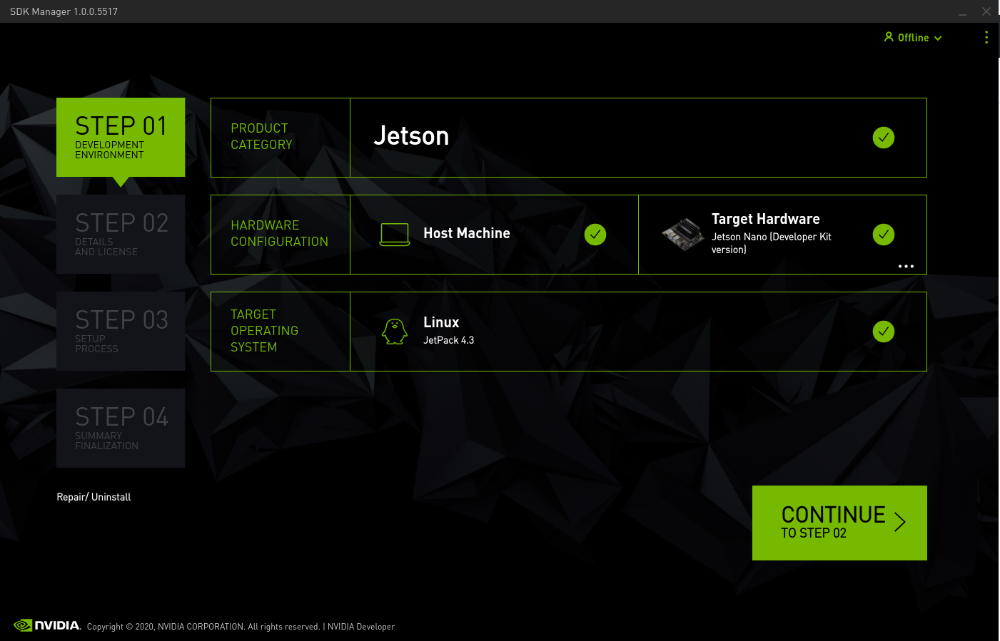
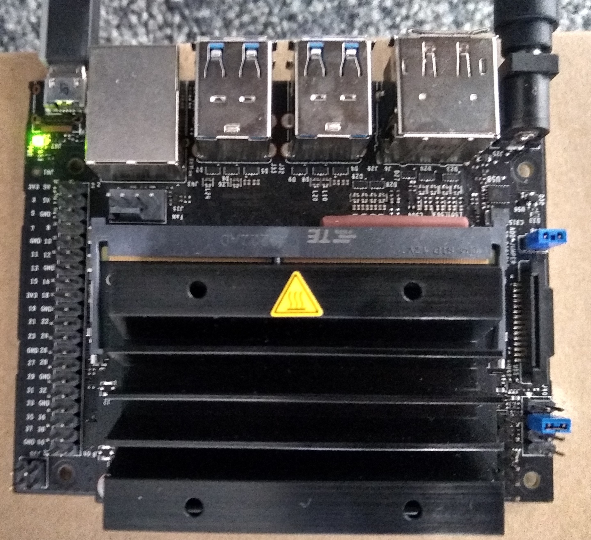
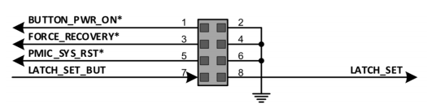

# NVIDIA container runtime for Wind River Linux
This demo is part of the WindRiver Labs project available at: http://labs.windriver.com

## Prerequisites
You are required to download NVIDIA property code from their website. To do so, you will need to create an NVIDIA Developer Network aacount.

Go into https://developer.nvidia.com/embedded/downloads , download the NVIDIA SDK Manager, install it and download all the files for the Jetson board you own.
The required Jetpack version is 4.3
```bash
/opt/nvidia/sdkmanager/sdkmanager
```



 **Image 1. SDK Manager installation**  
 
 
 Note: If you experience issues with Ycto not finding the debian packages run:
 ```bash
 $ mkdir /home/$USER/Downloads/nvidia/sdkm_downloads/NoDLA
 $ cp /home/$USER/Downloads/nvidia/sdkm_downloads/libnv* /home/$USER/Downloads/nvidia/sdkm_downloads/NoDLA
 ```
 
 
 
 
## Creating the project

```bash
git clone --branch WRLINUX_10_19_LTS https://windshare.windriver.com/remote.php/gitsmart/WRLinux-lts-19-Core/wrlinux-x
./wrlinux-x/setup.sh --all-layers --dl-layers --templates feature/docker --distro wrlinux-graphics
```
### Add meta-tegra layer
```bash
git clone --single-branch --branch wip-container-32.3.1 https://github.com/madisongh/meta-tegra.git layers/meta-tegra
```

```bash
. ./environment-setup-x86_64-wrlinuxsdk-linux
. ./oe-init-build-env
```

```bash
bitbake-layers add-layer ../layers/meta-tegra/
bitbake-layers add-layer ../layers/meta-tegra/contrib
```
## Configure the project
```bash
echo "BB_NO_NETWORK = '0'" >> conf/local.conf
echo 'INHERIT_DISTRO_remove = "whitelist"' >> conf/local.conf
```
### Set the machine to your Jetson Board
```bash
echo "MACHINE='jetson-nano-qspi-sd'" >> conf/local.conf
echo "PREFERRED_PROVIDER_virtual/kernel = 'linux-tegra'" >> conf/local.conf
 ```
 CUDA cannot be compiled with GCC versions higher than 7. Set GCC version to 7.%:
 ```bash
echo 'GCCVERSION = "7.%"' >> conf/local.conf
echo "require contrib/conf/include/gcc-compat.conf" >> conf/local.conf
```
Set the IMAGE export type to tegraflash for ease of deployment.
```bash 
echo 'IMAGE_CLASSES += "image_types_tegra"' >> conf/local.conf
echo 'IMAGE_FSTYPES = "tegraflash"' >> conf/local.conf
```

```bash
echo 'IMAGE_INSTALL_remove = "docker"' >> conf/local.conf
echo 'IMAGE_INSTALL_append = " docker-ce"' >> conf/local.conf

echo 'SECURITY_CFLAGS_pn-tini_append = " ${SECURITY_NOPIE_CFLAGS}"' >> conf/local.conf
```
Set NVIDIA download location
```bash
echo "NVIDIA_DEVNET_MIRROR='file:///home/$USER/Downloads/nvidia/sdkm_downloads'" >> conf/local.conf
echo 'CUDA_BINARIES_NATIVE = "cuda-binaries-ubuntu1604-native"' >> conf/local.conf

```
Enable ldconfig required by the nvidia-container-runtime
```bash
echo 'DISTRO_FEATURES_append = " ldconfig"' >> conf/local.conf

```
## Build the project
```bash
bitbake wrlinux-image-glibc-std-sato
```

## Burn the image into the SD card
```bash
unzip wrlinux-image-glibc-std-sato-jetson-nano-qspi-sd-20200226004915.tegraflash.zip -d wrlinux-jetson-nano
cd wrlinux-jetson-nano

```
Connect the Jetson Board to your computer using the microusb as shown in the image:


  
**Image 2. Recovery mode setup for Jetson Nano**


  


**Image 3. Pins Diagram for Jetson Nano**


After connecting the board, run:

```bash
sudo ./dosdcard.sh
```
This command will create the file `wrlinux-image-glibc-std-sato.sdcard` that contains the SD card image required to boot.

Burn the Image to the SD Card:
```bash
sudo dd if=wrlinux-image-glibc-std-sato.sdcard of=/dev/***** bs=8k
```
**Warning: substitute the of= device to the one that points to your sdcard**
**Failure to do so can lead to unexpected erase of hard disks**


## Deploy the target

Boot up the board and find the ip address with the command `ifconfig`.

Then, ssh into the machine and run docker:

```bash
$ ssh root@<ip_address>
$ wget https://github.com/paroque28/wrl-lts19-nvidia-containers/raw/master/tensorflow_demo.py
# docker run --runtime nvidia -e LD_LIBRARY_PATH=/usr/local/cuda-10.0/lib64/ -v $(pwd):/root -it tianxiang84/l4t-base:all
```

Inside the container run:
```bash
python3 /root/tensorflow_demo.py
```
